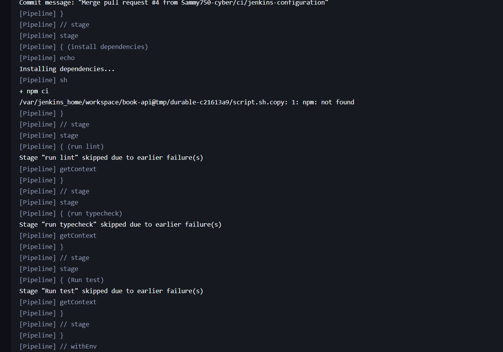
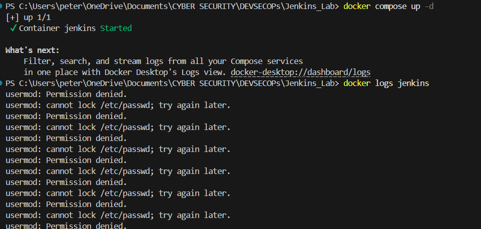
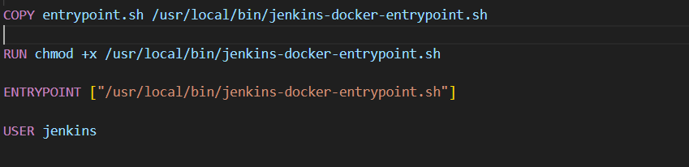
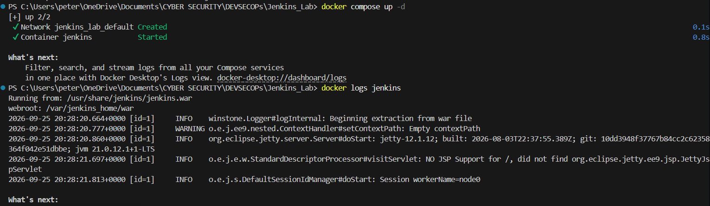
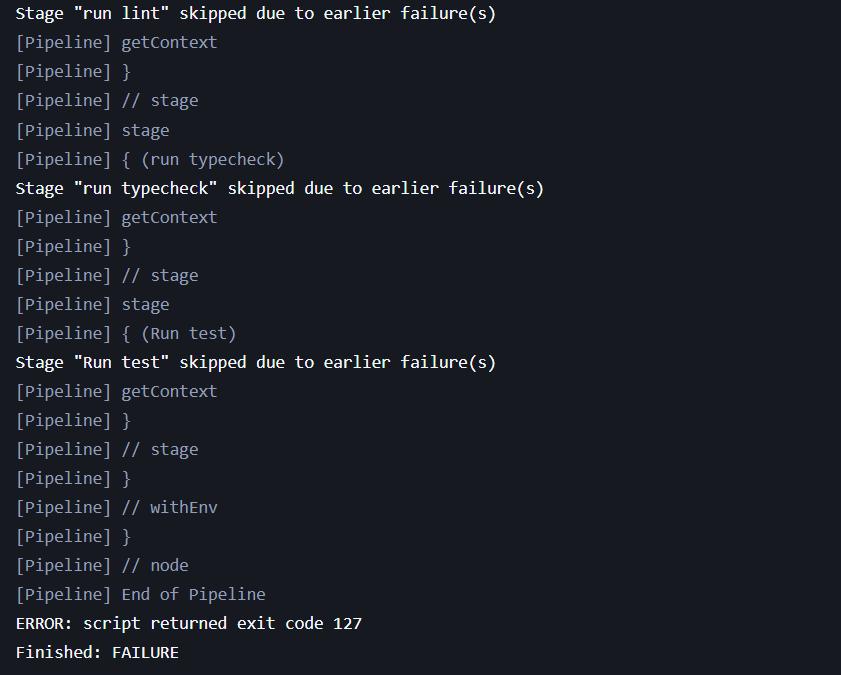

# Jenkins Configuration

Jenkins is an open-source automation server that sits at the heart of CI/CD (Continuous Integration and Continuous Delivery). It automatically builds, tests, and deploys code whenever changes are pushed to version control.

The goal is not replace Git, Docker, Trivy with Jenkins, but to use it to orchestrate a workflow for this tools.

# Jenkins Installation
-- describes the installation process( come back later)


## Connecting Jenkins to this project

After making sure that Jenkins UI is up and running, i connected it to this project `book-api`. There are two ways I could have done this, Include Jenkins config file into the project directory as part or the source code or just clone directly from the web ui.

I added a `Jenkins` file into the root directory. I then wrote the workflow

```Jenkinsfile
pipeline{
    agent any

    stages{
        stage("checkout"){
            steps{
                checkout scm
            }
        }

        stage("install dependencies"){
            steps{
                echo "Installing dependencies..."
                sh "npm ci"
            }
        }

        stage("run lint"){
            steps{
                echo "Running linter..."
                sh "npm run lint"
            }
        }

        stage("run typecheck"){
            steps{
                echo "Running typecheck"
                sh "npm run typecheck"
            }
        }

        stage("Run test"){
            steps{
                echo "Running test"
                sh "npm run test"
            }
        }
    }

    post{
        succes{
            echo "CI pipeline completed succefully."
        }

        failure{
            echo "CI pipeline failed. Check the stage log."
        }

        always{
            echo "CI pipeline execution completed."
        }
    }
}
```

## Pushed the code to github

After the writing the config file, i commited and push the changes to my remote gihub repository. then setup a new Jenkins pipeline through the Web UI. I Ran the pipeline then:



Since Jenkins is currently running a docker enironment, it doesn't have access to node, npx, npm and other commands the pipeline needs to run successfully. 

After so many researches on how to resolve this issues, I was left to choose between 3 options:

- **Install Nodejs into the Jenkins Image** - which would mean creating a custom jenkins image.

- **Use a docker-based build agent** - Jenkins launches a Node container for the build.

- **Use a dedicated Jenkins agent** - Run Jenkins workloads on a machine that already has Node.js.

For the sake of this Lab, I went for the second option. Because it teaches valuable containerized CI patterns.

```text
Jenkins
   │
   ├── Orchestration
   │
   ▼
Node.js Build Container
   │
   ├── npm ci
   ├── npm lint
   ├── npm test
   └── npm build
```

## Jenkins Docker Access Problem

For the option that i selected, there's a catch. Jenkins itself is running inside Docker, for it to create another docker container, it needs access to the `docker daemon`.

```text
Jenkins container
       │
       │ Docker API
       ▼
Docker daemon
       │
       ├── Node build container
       ├── Trivy container
       └── Application containers
```

If my current development environment was linux, it would have quite easier. Since i was using windows, i used `Docker CLI` from Jenkins and connected it to `Docker Daemon` exposed by Docker Desktop.

I modified the build script and ran it again, this time i got permissiom denied.



The approach was worth exploring, I need a solution that works, but then there was something wrong with the docker file that might be resposible.



The jenkins was running as a normal user, not privileged. So i modified the docker file, removed the last line entirely. changed the entrypoint accordingly, ran it again and it worked.




## Tested Jenkins build again



Even after the resolving the Docker-access issues, the test failed again, this was ok because the docker was no longer the problem. 