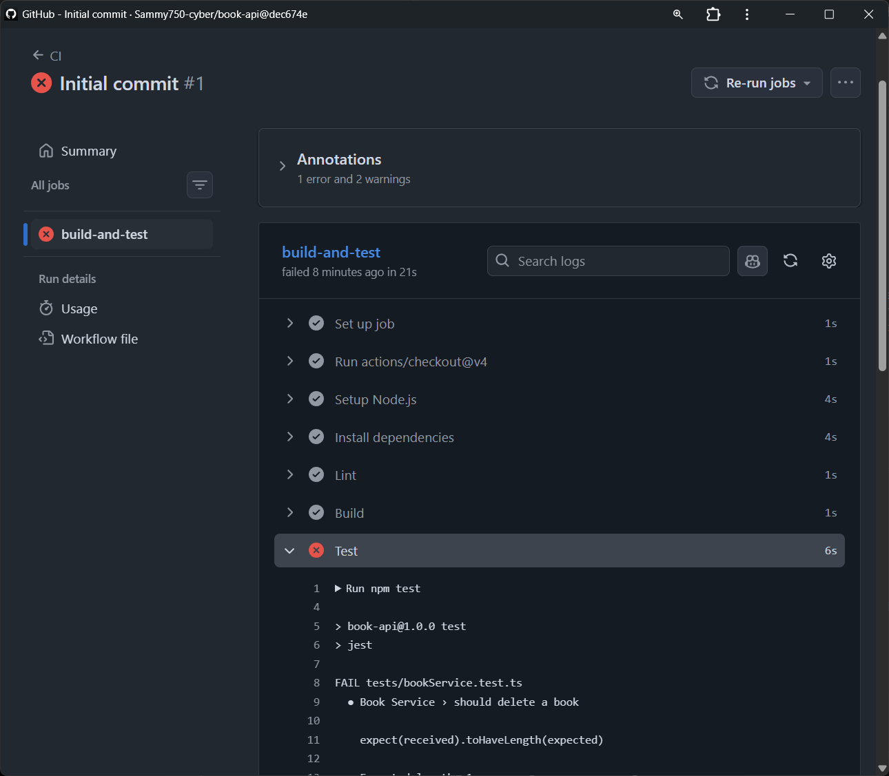
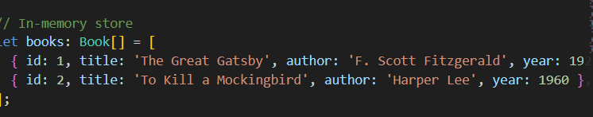
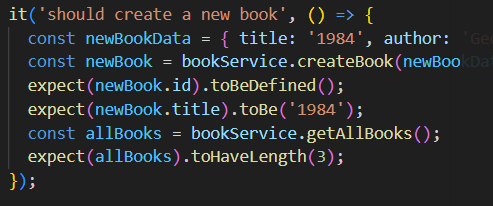
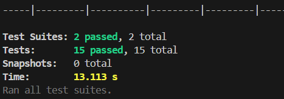
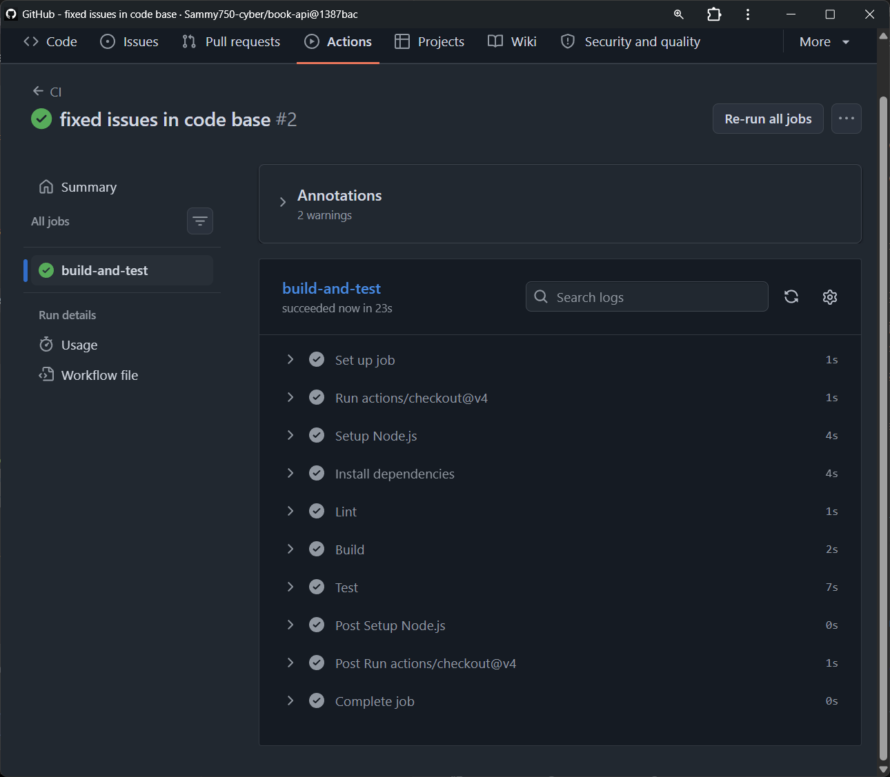
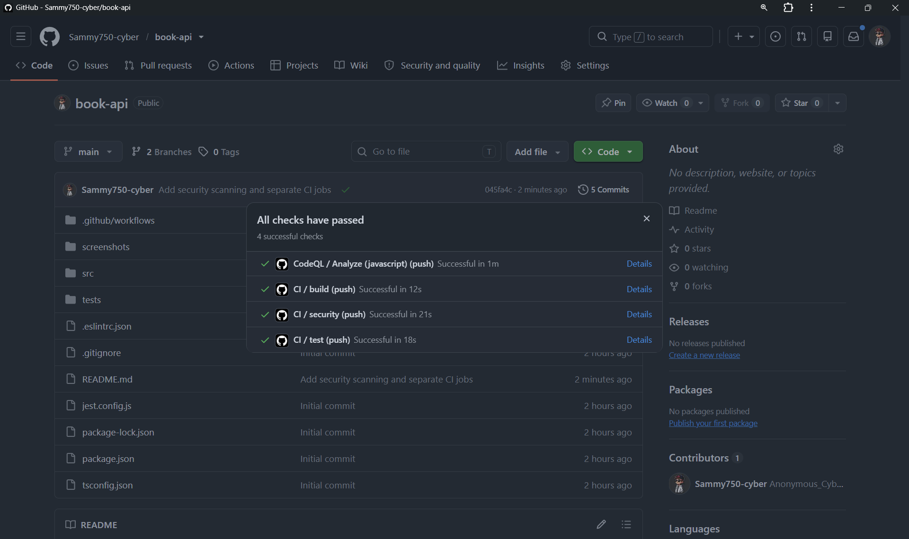
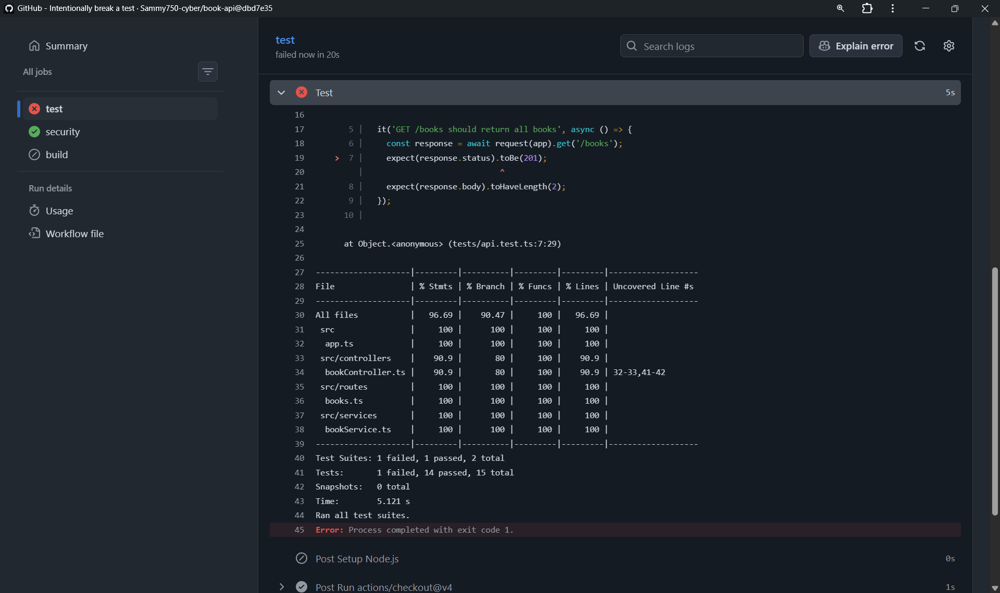
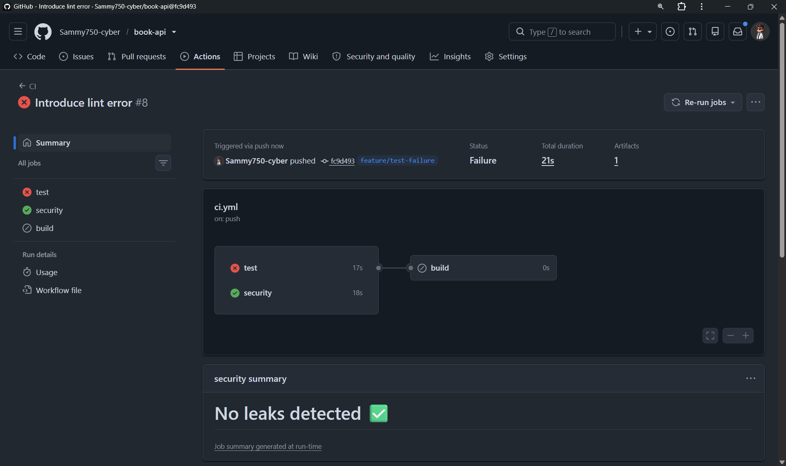

# BOOK API

I am currently building a career in DevSecOps which is a field in cyber security, in which part i am learning `Git & CI/CD`. The whole purpose of this project is to prove that i can actually implement what i learn instead of just understanding concepts.

## The project goal:
```text
[ ] Node.js application
[ ] package.json
[ ] package-lock.json
[ ] Test suite
[ ] ESLint
[ ] npm test
[ ] npm run lint
[ ] Build script if applicable
[ ] .github/workflows/ci.yml
[ ] Push workflow to GitHub
[ ] Verify workflow executes
[ ] Create a Pull Request
[ ] Verify CI executes against the PR
[ ] Intentionally introduce a test failure
[ ] Push the broken code
[ ] Observe CI failure
[ ] Fix the test
[ ] Push again
[ ] Verify CI passes
```

## My choice of application

I chose to build this application because it is actually a simple RESTful API project i could think of and it is also perfect to help me understand and demonstrate all the required CI/CD steps.

# Installation
```bash
git clone https://github.com/Sammy750-cyber/book-api.git
cd book-api
npm run dev # to run
npm build # To builf basically
```

## Testing The project

The thing with the project at this point of commit is that, it runs perfect as it should on my laptop, right?. Yeah, But it failed the test i gave it, it passed every job defined in the workflow but the `test` job.

Here's a proof of that:



### Reading through the test log

I found the problem, and yes it can be resolved

### The problems




The test file `test/bookService.test.ts runs it test sequentially in the same environment, the `bookService module uses a module-level array books and a `nextId counter` so these variables persist across tests. By the time the `delete` test was ran the length was already altered and is now `3`, so you delete on of 3 books, it should return 2 but the test expected `1`.

To resolve that, i added an exported `resetBooks` function to the `src/services/bookService.ts` and then updated the `tests/bookService.test.ts` accordingly, i added a `beforeEach` function to rest the state before each test.

It worked:



However this is local test, i still have to push it to make sure it really works.

Again it worked



## Important

One important thing i did was not to edit the main branch directly, created a seperate branch to implement fixes so i wouldn't interfere with the main working code. Now that it works i can merge.

## So Far 

The whole phase above demonstrated the architecture i have below, which is still basic. I am still and this is where i am so far

```text
                     GitHub
                        │
                 Push / Pull Request
                        │
                        ↓
                  ┌───────────┐
                  │    CI     │
                  └─────┬─────┘
                        │
                 Checkout Code
                        │
                        ↓
                  Setup Node.js
                        │
                        ↓
                     npm ci
                        │
              ┌─────────┴─────────┐
              ↓                   ↓
            Lint                Tests
              │                   │
              └─────────┬─────────┘
                        ↓
                      Build
                        │
                        ↓
                    CI Result
```

## Security Gates

Before now it had always been:

```text
Code
 ↓
Lint
 ↓
Tests
 ↓
Build
```

What this phase is meant to introduce:

```text
Code
 ↓
Lint
 ↓
Tests
 ↓
SAST
 ↓
SCA
 ↓
Secret Scanning
 ↓
Security Gate
 ↓
Build
```

The goal is to ensure the code passes the security gate before building.

**Security Gate:** A security gate is a condition that must be satisfied before the pipeline can continue.

The pipeline simply becomes:

```text
                Pull Request
                     │
                     ↓
                    CI
                     │
       ┌─────────────┼─────────────┐
       ↓             ↓             ↓
     Lint           Tests         SAST
       │             │             │
       └─────────────┴─────────────┘
                     │
                     ↓
                    SCA
                     │
                     ↓
              Secret Scanning
                     │
                     ↓
              Security Gate
                │         │
              PASS       FAIL
                │         │
                ↓         ↓
              Build     Block PR
```

The project itself didn't change, i just added additional layer of security analysis, I introduced codeql and improved the initial workflow.

I started off by editing the `ci.yml`, seperated job `[test, security]` and made sure build strictly depended on `[test, security]`.

### What is now included

- Separate jobs – test, security, and build run independently.

- Dependency – build has needs: [test, security], so it will only start after both jobs pass.

- Security job runs:

    - npm audit – checks for known vulnerabilities in dependencies.

    - gitleaks/gitleaks-action – scans the repository for hardcoded secrets.

Added CodeQL, It is a security-analysis system whose findings can become PR security signals.

### What it does:
- Runs CodeQL analysis on every push and pull request to main.

- Also runs a weekly scheduled scan for continuous security monitoring.

- Uses the official GitHub CodeQL actions (init, autobuild, analyze).

- Supports JavaScript/TypeScript (the language used in this project).

I commited the changes to the main branch amd here's the result.



## Time to test

To make the sure the code actually works and detects error in real-time, I intentionally introduced flaws

### Test 1 - Break the Tests

I introduced an incorrect expectation. The test failed gracefully even though it passed the security test, the `build` test to commence because it needed to pass the two prior tests.




### Test 2 - Introduce lint error

CUrrently the ESLint configuration enforces single quotes and semicolons. I chose a simple violation test if that actually works, i violated it.


