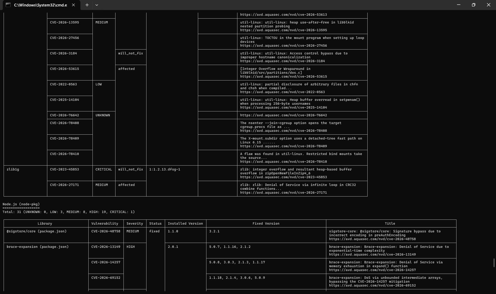
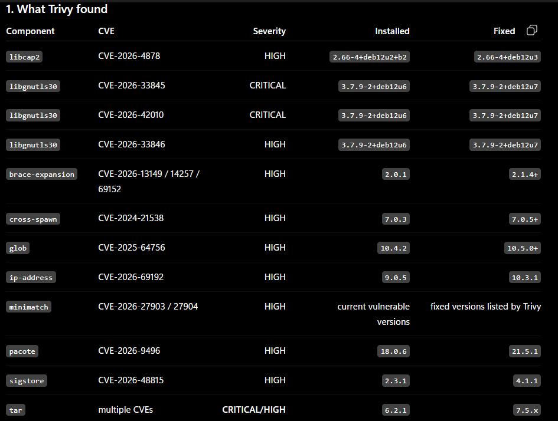

# BOOK API
# Secure Book API

A production-oriented Node.js and TypeScript REST API built to demonstrate professional Git workflows, CI/CD automation, containerization, and DevSecOps practices.

## Objectives

- Establish a professional Git workflow
- Build a tested REST API
- Implement continuous integration
- Implement continuous delivery
- Containerize the application
- Integrate security scanning
- Deploy to staging and production
- Demonstrate release and rollback strategies

## Technology

- Node.js
- TypeScript
- Express
- PostgreSQL
- Docker
- GitHub Actions

## Repository Workflow

The project uses feature branches and pull requests rather than direct development on `main`.

More documentation will be added as the project progresses.


## The project goal:
```text
[ ] Node.js application
[ ] package.json
[ ] package-lock.json
[ ] Test suite
[ ] ESLint
[ ] npm test
[ ] npm run lint
[ ] Build script if applicable
[ ] .github/workflows/ci.yml
[ ] Push workflow to GitHub
[ ] Verify workflow executes
[ ] Create a Pull Request
[ ] Verify CI executes against the PR
[ ] Intentionally introduce a test failure
[ ] Push the broken code
[ ] Observe CI failure
[ ] Fix the test
[ ] Push again
[ ] Verify CI passes
```

## My choice of application

I chose to build this application because it is actually a simple RESTful API project i could think of and it is also perfect to help me understand and demonstrate all the required CI/CD steps.

# Installation
```bash
git clone https://github.com/Sammy750-cyber/book-api.git
cd book-api
npm run dev # to run
npm build # To builf basically
```

## Testing The project

The thing with the project at this point of commit is that, it runs perfect as it should on my laptop, right?. Yeah, But it failed the test i gave it, it passed every job defined in the workflow but the `test` job.

Here's a proof of that:


### Reading through the test log

I found the problem, and yes it can be resolved

### The problems


The test file `test/bookService.test.ts runs it test sequentially in the same environment, the `bookService module uses a module-level array books and a `nextId counter` so these variables persist across tests. By the time the `delete` test was ran the length was already altered and is now `3`, so you delete on of 3 books, it should return 2 but the test expected `1`.

To resolve that, i added an exported `resetBooks` function to the `src/services/bookService.ts` and then updated the `tests/bookService.test.ts` accordingly, i added a `beforeEach` function to rest the state before each test.

It worked:


However this is local test, i still have to push it to make sure it really works.

Again it worked


## Important

One important thing i did was not to edit the main branch directly, created a seperate branch to implement fixes so i wouldn't interfere with the main working code. Now that it works i can merge.

## So Far 

The whole phase above demonstrated the architecture i have below, which is still basic. I am still and this is where i am so far

```text
             PRb
              │
              ▼
          CI Pipeline
              │
      ┌───────┴────────┐
      ▼                ▼
   Quality          Security
      │                │
 ┌────┼────┐       ┌───┴────┐
 │    │    │       │        │
Lint Type Tests   Audit   Gitleaks
          │
          ▼
       Coverage
          │
          ▼
      Threshold
          │
          ▼
        Build
```

## Security Gates

Before now it had always been:

```text
Code
 ↓
Lint
 ↓
Tests
 ↓
Build
```

What this phase is meant to introduce:

```text
Code
 ↓
Lint
 ↓
Tests
 ↓
SAST
 ↓
SCA
 ↓
Secret Scanning
 ↓
Security Gate
 ↓
Build
```

The goal is to ensure the code passes the security gate before building.

**Security Gate:** A security gate is a condition that must be satisfied before the pipeline can continue.

The pipeline simply becomes:

```text
                Pull Request
                     │
                     ↓
                    CI
                     │
       ┌─────────────┼─────────────┐
       ↓             ↓             ↓
     Lint           Tests         SAST
       │             │             │
       └─────────────┴─────────────┘
                     │
                     ↓
                    SCA
                     │
                     ↓
              Secret Scanning
                     │
                     ↓
              Security Gate
                │         │
              PASS       FAIL
                │         │
                ↓         ↓
              Build     Block PR
```

The project itself didn't change, i just added additional layer of security analysis, I introduced codeql and improved the initial workflow.

I started off by editing the `ci.yml`, seperated job `[test, security]` and made sure build strictly depended on `[test, security]`.

### What is now included

- Separate jobs – test, security, and build run independently.

- Dependency – build has needs: [test, security], so it will only start after both jobs pass.

- Security job runs:

    - npm audit – checks for known vulnerabilities in dependencies.

    - gitleaks/gitleaks-action – scans the repository for hardcoded secrets.

Added CodeQL, It is a security-analysis system whose findings can become PR security signals.

### What it does:
- Runs CodeQL analysis on every push and pull request to main.

- Also runs a weekly scheduled scan for continuous security monitoring.

- Uses the official GitHub CodeQL actions (init, autobuild, analyze).

- Supports JavaScript/TypeScript (the language used in this project).

I commited the changes to the main branch amd here's the result.


## Time to test

To make the sure the code actually works and detects error in real-time, I intentionally introduced flaws

### Test 1 - Break the Tests

I introduced an incorrect expectation. The test failed gracefully even though it passed the security test, the `build` test to commence because it needed to pass the two prior tests.


### Test 2 - Introduce lint error

CUrrently the ESLint configuration enforces single quotes and semicolons. I chose a simple violation test if that actually works, i violated it.


# Containerization

## Objectives

1. Production Dockerfile
2. Docker compose
3. Docker health checks
4. Production Docker container
5. Docker image CI
6. Docker vulnerability scanning
7. Docker registry
8. Image tagging

## Goal
The goal is to achieve something that looks like this

```text
                    GitHub
                       │
                       ▼
                  Pull Request
                       │
              ┌────────┴────────┐
              ▼                 ▼
             CI              Security
              │                 │
        ┌─────┼─────┐      ┌────┼─────┐
        ▼     ▼     ▼      ▼         ▼
      Lint  Type  Tests   Audit    Gitleaks
              │
              └──────┬──────────────┘
                     ▼
                Application
                   Build
                     │
                     ▼
                Docker Build
                     │
                     ▼
             Container Security
                     │
                     ▼
                Docker Image
                     │
                     ▼
              Container Registry
```

## Target docker architecture

```text
                 Docker Network
                       │
          ┌────────────┴────────────┐
          │                         │
          ▼                         ▼
   ┌──────────────┐          ┌──────────────┐
   │   Book API   │─────────▶│  PostgreSQL  │
   │   Node.js    │          │   Database   │
   │              │          │              │
   │ Port 3000    │          │ Port 5432    │
   └──────────────┘          └──────────────┘
          │
          │
          ▼
      /health
```
### WHy 2 stages?

The builder contains everything required to compile the application

```text
TypeScript
Jest
ESLint
development dependencies
source code
```
and the final image recieves only:
```text
Node.js
production dependencies
compiled JavaScript
```
This reduces the attack surface and keeps build tooling out of the production container.


With the docker files created and properly configured.

I built the image

```bash
docker build -t book-api:local .
```

After building, i ran the image, i was face with some problems which involved connecting to database. I to resolve that i had to create a container with postgres included allowed communication between the `book-api` and the `postgres` database using `docker-compose.yml`

```bash
docker compose up --build
```

## Container Security

Now that the Book API is containerized, the next step is to make container security part of the delivery pipeline.

Target Pipeline becomes:
```text
Pull Request
     │
     ▼
┌───────────────┐
│ Application CI│
│               │
│ Lint          │
│ Typecheck     │
│ Tests         │
│ Build         │
└───────┬───────┘
        │
        ▼
┌────────────────┐
│ Security       │
│                │
│ npm audit      │
│ Gitleaks       │
│ CodeQL         │
└───────┬────────┘
        │
        ▼
┌────────────────┐
│ Docker Build   │
└───────┬────────┘
        │
        ▼
┌────────────────┐
│ Trivy Scan     │
│                │
│ OS packages    │
│ Node packages  │
│ Vulnerabilities│
└───────┬────────┘
        │
        ▼
     Registry
```

After installinfg `trivy`, I tested to see how it works locally.

```bash
trivy.exe image \
  --format json \
  --output trivy-report.json \
  book-api:local
```
result:



For filtered outputs, i used:

```bash
trivy.exe image \
  --severity HIGH,CRITICAL \
  --exit-code 1 \
  book-api:local
  ```

  ## Adding Trivy to Github Actions

  I created a new workflow `containersecurity.yml`. The workflow basically demonstraits:

  ```text
  Checkout
   ↓
Docker Build
   ↓
Trivy
   ↓
HIGH/CRITICAL?
   ├── YES → FAIL
   └── NO  → PASS
```

The workflow was configured to on fail only on `critical` and `severe` vulnerabilities while reporting others.

```yml
name: Container Security

on:
  pull_request:
    branches: [main]
  push:
    branches: [main]

permissions:
  contents: read

jobs:
  container-scan:
    name: Build and Scan Container
    runs-on: ubuntu-latest

    steps:
      - name: Checkout repository
        uses: actions/checkout@v4

      - name: Build Docker image
        run: |
          docker build \
            -t book-api:${{ github.sha }} \
            .

      - name: Scan container image
        uses: aquasecurity/trivy-action@0.28.0
        with:
          image-ref: book-api:${{ github.sha }}
          format: table
          severity: HIGH,CRITICAL
          ignore-unfixed: true
          exit-code: 1
```

The main reason for the `ignore-unfixed:true` is the the pipeline won't fail over vulnerabilites for which no `fix` is currently available.

After pushing configuration to remote repository, as expected the container security pipeline was triggered. The pipeline failed due to high vulnnerabilty findinds.



To fix this issues, i first modifiwed the `Dockerfile` to upgrade os during build. and updated the `docker-compose.yml`

I ran the scan again

```bash
.\trivy.exe image --severity HIGH,CRITICAL --ignore-unfixed --exit-code 1 book-api-api:latest
```

and this time around the container was free of critical, high vulns.

```text
.\trivy.exe image --severity HIGH,CRITICAL --ignore-unfixed --exit-code 1 book-api-api:latest
2026-09-09T17:04:36-07:00       INFO    [vuln] Vulnerability scanning is enabled
2026-09-09T17:04:36-07:00       INFO    [secret] Secret scanning is enabled
2026-09-09T17:04:36-07:00       INFO    [secret] If your scanning is slow, please try '--scanners vuln' to disable secret scanning
2026-09-09T17:04:36-07:00       INFO    [secret] Please see https://trivy.dev/docs/v0.74/guide/scanner/secret#recommendation for faster secret detection
2026-09-09T17:04:40-07:00       INFO    Detected OS     family="debian" version="12.15"
2026-09-09T17:04:40-07:00       INFO    [debian] Detecting vulnerabilities...   os_version="12" pkg_num=88
2026-09-09T17:04:40-07:00       INFO    Number of language-specific files       num=1
2026-09-09T17:04:40-07:00       INFO    [node-pkg] Detecting vulnerabilities...
2026-09-09T17:04:41-07:00       WARN    Using severities from other vendors for some vulnerabilities. Read https://trivy.dev/docs/v0.74/guide/scanner/vulnerability#severity-selection for details.

Report Summary

┌───────────────────────────────────────────────────────────────────────┬──────────┬─────────────────┬─────────┐
│                                Target                                 │   Type   │ Vulnerabilities │ Secrets │
├───────────────────────────────────────────────────────────────────────┼──────────┼─────────────────┼─────────┤
│ book-api-api:latest (debian 12.15)                                    │  debian  │        0        │    -    │
├───────────────────────────────────────────────────────────────────────┼──────────┼─────────────────┼─────────┤
│ app/node_modules/accepts/package.json                                 │ node-pkg │        0        │    -    │
├───────────────────────────────────────────────────────────────────────┼──────────┼─────────────────┼─────────┤
│ app/node_modules/array-flatten/package.json                           │ node-pkg │        0        │    -    │
├───────────────────────────────────────────────────────────────────────┼──────────┼─────────────────┼─────────┤
│ app/node_modules/body-parser/node_modules/debug/package.json          │ node-pkg │        0        │    -    │
├───────────────────────────────────────────────────────────────────────┼──────────┼─────────────────┼─────────┤
│ app/node_modules/body-parser/node_modules/ms/package.json             │ node-pkg │        0        │    -    │
├───────────────────────────────────────────────────────────────────────┼──────────┼─────────────────┼─────────┤
│ app/node_modules/body-parser/package.json                             │ node-pkg │        0        │    -    │
├───────────────────────────────────────────────────────────────────────┼──────────┼─────────────────┼─────────┤
│ app/node_modules/bytes/package.json                                   │ node-pkg │        0        │    -    │
├───────────────────────────────────────────────────────────────────────┼──────────┼─────────────────┼─────────┤
│ app/node_modules/call-bind-apply-helpers/package.json                 │ node-pkg │        0        │    -    │
├───────────────────────────────────────────────────────────────────────┼──────────┼─────────────────┼─────────┤
│ app/node_modules/call-bound/package.json                              │ node-pkg │        0        │    -    │
├───────────────────────────────────────────────────────────────────────┼──────────┼─────────────────┼─────────┤
│ app/node_modules/content-disposition/package.json                     │ node-pkg │        0        │    -    │
├───────────────────────────────────────────────────────────────────────┼──────────┼─────────────────┼─────────┤
│ app/node_modules/content-type/package.json                            │ node-pkg │        0        │    -    │
├───────────────────────────────────────────────────────────────────────┼──────────┼─────────────────┼─────────┤
│ app/node_modules/cookie-signature/package.json                        │ node-pkg │        0        │    -    │
├───────────────────────────────────────────────────────────────────────┼──────────┼─────────────────┼─────────┤
│ app/node_modules/cookie/package.json                                  │ node-pkg │        0        │    -    │
├───────────────────────────────────────────────────────────────────────┼──────────┼─────────────────┼─────────┤
│ app/node_modules/depd/package.json                                    │ node-pkg │        0        │    -    │
├───────────────────────────────────────────────────────────────────────┼──────────┼─────────────────┼─────────┤
│ app/node_modules/destroy/package.json                                 │ node-pkg │        0        │    -    │
├───────────────────────────────────────────────────────────────────────┼──────────┼─────────────────┼─────────┤
│ app/node_modules/dotenv/package.json                                  │ node-pkg │        0        │    -    │
├───────────────────────────────────────────────────────────────────────┼──────────┼─────────────────┼─────────┤
│ app/node_modules/dunder-proto/package.json                            │ node-pkg │        0        │    -    │
├───────────────────────────────────────────────────────────────────────┼──────────┼─────────────────┼─────────┤
│ app/node_modules/ee-first/package.json                                │ node-pkg │        0        │    -    │
├───────────────────────────────────────────────────────────────────────┼──────────┼─────────────────┼─────────┤
│ app/node_modules/encodeurl/package.json                               │ node-pkg │        0        │    -    │
├───────────────────────────────────────────────────────────────────────┼──────────┼─────────────────┼─────────┤
│ app/node_modules/es-define-property/package.json                      │ node-pkg │        0        │    -    │
├───────────────────────────────────────────────────────────────────────┼──────────┼─────────────────┼─────────┤
│ app/node_modules/es-errors/package.json                               │ node-pkg │        0        │    -    │
├───────────────────────────────────────────────────────────────────────┼──────────┼─────────────────┼─────────┤
│ app/node_modules/es-object-atoms/package.json                         │ node-pkg │        0        │    -    │
├───────────────────────────────────────────────────────────────────────┼──────────┼─────────────────┼─────────┤
│ app/node_modules/escape-html/package.json                             │ node-pkg │        0        │    -    │
├───────────────────────────────────────────────────────────────────────┼──────────┼─────────────────┼─────────┤
│ app/node_modules/etag/package.json                                    │ node-pkg │        0        │    -    │
├───────────────────────────────────────────────────────────────────────┼──────────┼─────────────────┼─────────┤
│ app/node_modules/express/node_modules/debug/package.json              │ node-pkg │        0        │    -    │
├───────────────────────────────────────────────────────────────────────┼──────────┼─────────────────┼─────────┤
│ app/node_modules/express/node_modules/ms/package.json                 │ node-pkg │        0        │    -    │
├───────────────────────────────────────────────────────────────────────┼──────────┼─────────────────┼─────────┤
│ app/node_modules/express/node_modules/qs/package.json                 │ node-pkg │        0        │    -    │
├───────────────────────────────────────────────────────────────────────┼──────────┼─────────────────┼─────────┤
│ app/node_modules/express/package.json                                 │ node-pkg │        0        │    -    │
├───────────────────────────────────────────────────────────────────────┼──────────┼─────────────────┼─────────┤
│ app/node_modules/finalhandler/node_modules/debug/package.json         │ node-pkg │        0        │    -    │
├───────────────────────────────────────────────────────────────────────┼──────────┼─────────────────┼─────────┤
│ app/node_modules/finalhandler/node_modules/ms/package.json            │ node-pkg │        0        │    -    │
├───────────────────────────────────────────────────────────────────────┼──────────┼─────────────────┼─────────┤
│ app/node_modules/finalhandler/package.json                            │ node-pkg │        0        │    -    │
├───────────────────────────────────────────────────────────────────────┼──────────┼─────────────────┼─────────┤
│ app/node_modules/forwarded/package.json                               │ node-pkg │        0        │    -    │
├───────────────────────────────────────────────────────────────────────┼──────────┼─────────────────┼─────────┤
│ app/node_modules/fresh/package.json                                   │ node-pkg │        0        │    -    │
├───────────────────────────────────────────────────────────────────────┼──────────┼─────────────────┼─────────┤
│ app/node_modules/function-bind/package.json                           │ node-pkg │        0        │    -    │
├───────────────────────────────────────────────────────────────────────┼──────────┼─────────────────┼─────────┤
│ app/node_modules/get-intrinsic/package.json                           │ node-pkg │        0        │    -    │
├───────────────────────────────────────────────────────────────────────┼──────────┼─────────────────┼─────────┤
│ app/node_modules/get-proto/package.json                               │ node-pkg │        0        │    -    │
├───────────────────────────────────────────────────────────────────────┼──────────┼─────────────────┼─────────┤
│ app/node_modules/gopd/package.json                                    │ node-pkg │        0        │    -    │
├───────────────────────────────────────────────────────────────────────┼──────────┼─────────────────┼─────────┤
│ app/node_modules/has-symbols/package.json                             │ node-pkg │        0        │    -    │
├───────────────────────────────────────────────────────────────────────┼──────────┼─────────────────┼─────────┤
│ app/node_modules/hasown/package.json                                  │ node-pkg │        0        │    -    │
├───────────────────────────────────────────────────────────────────────┼──────────┼─────────────────┼─────────┤
│ app/node_modules/http-errors/package.json                             │ node-pkg │        0        │    -    │
├───────────────────────────────────────────────────────────────────────┼──────────┼─────────────────┼─────────┤
│ app/node_modules/iconv-lite/package.json                              │ node-pkg │        0        │    -    │
├───────────────────────────────────────────────────────────────────────┼──────────┼─────────────────┼─────────┤
│ app/node_modules/inherits/package.json                                │ node-pkg │        0        │    -    │
├───────────────────────────────────────────────────────────────────────┼──────────┼─────────────────┼─────────┤
│ app/node_modules/ipaddr.js/package.json                               │ node-pkg │        0        │    -    │
├───────────────────────────────────────────────────────────────────────┼──────────┼─────────────────┼─────────┤
│ app/node_modules/math-intrinsics/package.json                         │ node-pkg │        0        │    -    │
├───────────────────────────────────────────────────────────────────────┼──────────┼─────────────────┼─────────┤
│ app/node_modules/media-typer/package.json                             │ node-pkg │        0        │    -    │
├───────────────────────────────────────────────────────────────────────┼──────────┼─────────────────┼─────────┤
│ app/node_modules/merge-descriptors/package.json                       │ node-pkg │        0        │    -    │
├───────────────────────────────────────────────────────────────────────┼──────────┼─────────────────┼─────────┤
│ app/node_modules/methods/package.json                                 │ node-pkg │        0        │    -    │
├───────────────────────────────────────────────────────────────────────┼──────────┼─────────────────┼─────────┤
│ app/node_modules/mime-db/package.json                                 │ node-pkg │        0        │    -    │
├───────────────────────────────────────────────────────────────────────┼──────────┼─────────────────┼─────────┤
│ app/node_modules/mime-types/package.json                              │ node-pkg │        0        │    -    │
├───────────────────────────────────────────────────────────────────────┼──────────┼─────────────────┼─────────┤
│ app/node_modules/mime/package.json                                    │ node-pkg │        0        │    -    │
├───────────────────────────────────────────────────────────────────────┼──────────┼─────────────────┼─────────┤
│ app/node_modules/ms/package.json                                      │ node-pkg │        0        │    -    │
├───────────────────────────────────────────────────────────────────────┼──────────┼─────────────────┼─────────┤
│ app/node_modules/negotiator/package.json                              │ node-pkg │        0        │    -    │
├───────────────────────────────────────────────────────────────────────┼──────────┼─────────────────┼─────────┤
│ app/node_modules/object-inspect/package.json                          │ node-pkg │        0        │    -    │
├───────────────────────────────────────────────────────────────────────┼──────────┼─────────────────┼─────────┤
│ app/node_modules/on-finished/package.json                             │ node-pkg │        0        │    -    │
├───────────────────────────────────────────────────────────────────────┼──────────┼─────────────────┼─────────┤
│ app/node_modules/parseurl/package.json                                │ node-pkg │        0        │    -    │
├───────────────────────────────────────────────────────────────────────┼──────────┼─────────────────┼─────────┤
│ app/node_modules/path-to-regexp/package.json                          │ node-pkg │        0        │    -    │
├───────────────────────────────────────────────────────────────────────┼──────────┼─────────────────┼─────────┤
│ app/node_modules/pg-cloudflare/package.json                           │ node-pkg │        0        │    -    │
├───────────────────────────────────────────────────────────────────────┼──────────┼─────────────────┼─────────┤
│ app/node_modules/pg-connection-string/package.json                    │ node-pkg │        0        │    -    │
├───────────────────────────────────────────────────────────────────────┼──────────┼─────────────────┼─────────┤
│ app/node_modules/pg-int8/package.json                                 │ node-pkg │        0        │    -    │
├───────────────────────────────────────────────────────────────────────┼──────────┼─────────────────┼─────────┤
│ app/node_modules/pg-pool/package.json                                 │ node-pkg │        0        │    -    │
├───────────────────────────────────────────────────────────────────────┼──────────┼─────────────────┼─────────┤
│ app/node_modules/pg-protocol/package.json                             │ node-pkg │        0        │    -    │
├───────────────────────────────────────────────────────────────────────┼──────────┼─────────────────┼─────────┤
│ app/node_modules/pg-types/package.json                                │ node-pkg │        0        │    -    │
├───────────────────────────────────────────────────────────────────────┼──────────┼─────────────────┼─────────┤
│ app/node_modules/pg/package.json                                      │ node-pkg │        0        │    -    │
├───────────────────────────────────────────────────────────────────────┼──────────┼─────────────────┼─────────┤
│ app/node_modules/pgpass/package.json                                  │ node-pkg │        0        │    -    │
├───────────────────────────────────────────────────────────────────────┼──────────┼─────────────────┼─────────┤
│ app/node_modules/postgres-array/package.json                          │ node-pkg │        0        │    -    │
├───────────────────────────────────────────────────────────────────────┼──────────┼─────────────────┼─────────┤
│ app/node_modules/postgres-bytea/package.json                          │ node-pkg │        0        │    -    │
├───────────────────────────────────────────────────────────────────────┼──────────┼─────────────────┼─────────┤
│ app/node_modules/postgres-date/package.json                           │ node-pkg │        0        │    -    │
├───────────────────────────────────────────────────────────────────────┼──────────┼─────────────────┼─────────┤
│ app/node_modules/postgres-interval/package.json                       │ node-pkg │        0        │    -    │
├───────────────────────────────────────────────────────────────────────┼──────────┼─────────────────┼─────────┤
│ app/node_modules/proxy-addr/package.json                              │ node-pkg │        0        │    -    │
├───────────────────────────────────────────────────────────────────────┼──────────┼─────────────────┼─────────┤
│ app/node_modules/qs/package.json                                      │ node-pkg │        0        │    -    │
├───────────────────────────────────────────────────────────────────────┼──────────┼─────────────────┼─────────┤
│ app/node_modules/range-parser/package.json                            │ node-pkg │        0        │    -    │
├───────────────────────────────────────────────────────────────────────┼──────────┼─────────────────┼─────────┤
│ app/node_modules/raw-body/package.json                                │ node-pkg │        0        │    -    │
├───────────────────────────────────────────────────────────────────────┼──────────┼─────────────────┼─────────┤
│ app/node_modules/safe-buffer/package.json                             │ node-pkg │        0        │    -    │
├───────────────────────────────────────────────────────────────────────┼──────────┼─────────────────┼─────────┤
│ app/node_modules/safer-buffer/package.json                            │ node-pkg │        0        │    -    │
├───────────────────────────────────────────────────────────────────────┼──────────┼─────────────────┼─────────┤
│ app/node_modules/send/node_modules/debug/node_modules/ms/package.json │ node-pkg │        0        │    -    │
├───────────────────────────────────────────────────────────────────────┼──────────┼─────────────────┼─────────┤
│ app/node_modules/send/node_modules/debug/package.json                 │ node-pkg │        0        │    -    │
├───────────────────────────────────────────────────────────────────────┼──────────┼─────────────────┼─────────┤
│ app/node_modules/send/package.json                                    │ node-pkg │        0        │    -    │
├───────────────────────────────────────────────────────────────────────┼──────────┼─────────────────┼─────────┤
│ app/node_modules/serve-static/package.json                            │ node-pkg │        0        │    -    │
├───────────────────────────────────────────────────────────────────────┼──────────┼─────────────────┼─────────┤
│ app/node_modules/setprototypeof/package.json                          │ node-pkg │        0        │    -    │
├───────────────────────────────────────────────────────────────────────┼──────────┼─────────────────┼─────────┤
│ app/node_modules/side-channel-list/package.json                       │ node-pkg │        0        │    -    │
├───────────────────────────────────────────────────────────────────────┼──────────┼─────────────────┼─────────┤
│ app/node_modules/side-channel-map/package.json                        │ node-pkg │        0        │    -    │
├───────────────────────────────────────────────────────────────────────┼──────────┼─────────────────┼─────────┤
│ app/node_modules/side-channel-weakmap/package.json                    │ node-pkg │        0        │    -    │
├───────────────────────────────────────────────────────────────────────┼──────────┼─────────────────┼─────────┤
│ app/node_modules/side-channel/package.json                            │ node-pkg │        0        │    -    │
├───────────────────────────────────────────────────────────────────────┼──────────┼─────────────────┼─────────┤
│ app/node_modules/split2/package.json                                  │ node-pkg │        0        │    -    │
├───────────────────────────────────────────────────────────────────────┼──────────┼─────────────────┼─────────┤
│ app/node_modules/statuses/package.json                                │ node-pkg │        0        │    -    │
├───────────────────────────────────────────────────────────────────────┼──────────┼─────────────────┼─────────┤
│ app/node_modules/toidentifier/package.json                            │ node-pkg │        0        │    -    │
├───────────────────────────────────────────────────────────────────────┼──────────┼─────────────────┼─────────┤
│ app/node_modules/type-is/package.json                                 │ node-pkg │        0        │    -    │
├───────────────────────────────────────────────────────────────────────┼──────────┼─────────────────┼─────────┤
│ app/node_modules/unpipe/package.json                                  │ node-pkg │        0        │    -    │
├───────────────────────────────────────────────────────────────────────┼──────────┼─────────────────┼─────────┤
│ app/node_modules/utils-merge/package.json                             │ node-pkg │        0        │    -    │
├───────────────────────────────────────────────────────────────────────┼──────────┼─────────────────┼─────────┤
│ app/node_modules/vary/package.json                                    │ node-pkg │        0        │    -    │
├───────────────────────────────────────────────────────────────────────┼──────────┼─────────────────┼─────────┤
│ app/node_modules/xtend/package.json                                   │ node-pkg │        0        │    -    │
├───────────────────────────────────────────────────────────────────────┼──────────┼─────────────────┼─────────┤
│ app/package.json                                                      │ node-pkg │        0        │    -    │
├───────────────────────────────────────────────────────────────────────┼──────────┼─────────────────┼─────────┤
│ opt/yarn-v1.22.22/package.json                                        │ node-pkg │        0        │    -    │
├───────────────────────────────────────────────────────────────────────┼──────────┼─────────────────┼─────────┤
│ usr/local/lib/node_modules/corepack/package.json                      │ node-pkg │        0        │    -    │
└───────────────────────────────────────────────────────────────────────┴──────────┴─────────────────┴─────────┘
Legend:
- '-': Not scanned
- '0': Clean (no security findings detected)
```
